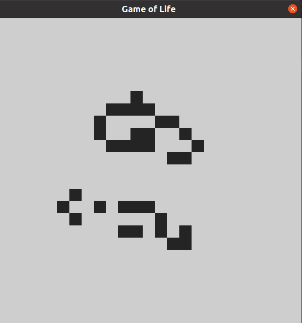

# Game of life



## Usage

First you need to install dependencies:

```bash
go get -d ./...
```

To run program:

```bash
go run main.go
```

Press 'S' to Start/Stop the program when using GUI. 

To run tests:

```bash
go test
```

## Modifying

You can change field size by changing variables <code>SIZEX</code> and <code>SIZEY</code> in <code>logic/gameoflife.go:7</code>